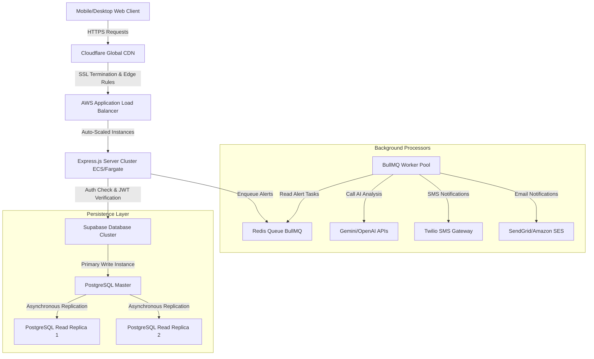

# GuardianLink - Production Scaling Architecture

This document describes how GuardianLink would scale to support a high-volume, production deployment at a national scale.

---

## 1. Architectural Diagram

Below is the target architecture for a highly available, globally distributed safety alert dispatch system.

---

## 2. High-Volume Alert Queueing (Redis + BullMQ)

In the current implementation, Express routes call Twilio and SMTP APIs synchronously during an alert request. For national-scale deployment, this blocks Express event loops and makes alert delivery vulnerable to third-party API downtime.

### Scaled Approach:
- **Asynchronous Task Queue**: When an SOS is triggered, the Express API immediately records the incident in Postgres, pushes an `alert_dispatch` task containing the `incident_id` and raw details to a **Redis-backed queue (e.g., BullMQ or AWS SQS)**, and returns a `202 Accepted` to the client.
- **Worker Pools**: A group of dedicated worker nodes consumes tasks from the Redis queue. If Twilio's API responds slowly or is temporarily down, the worker retries the task with exponential backoff without affecting the core API server cluster.
- **Dead Letter Queue (DLQ)**: Alerts that fail after maximum retries are routed to a DLQ for immediate administrator inspection and alert fallback.

---

## 3. Database Scaling (Supabase / Postgres)

Postgres performance can become a bottleneck when millions of users continuously pull contacts, settings, and logs.

### Scaled Approach:
- **Write-Read Separation**:
  - **Writes** (incident creations, settings updates) go directly to the PostgreSQL Primary Master.
  - **Reads** (loading dashboard settings, historical incident timelines) are load-balanced across multiple **Read Replicas** using connection poolers like **PgBouncer** to manage connection limits efficiently.
- **Efficient Indexing**: 
  We have pre-configured indexes on foreign keys and active statuses in [`schema.sql`](file:///d:/promptwargdgmmdu/schema.sql):
  - `idx_contacts_user_id` and `idx_incidents_user_id` prevent N+1 query scans when fetching data for isolated user sessions.
  - `idx_incidents_user_active` is a conditional index focusing only on `active` incidents. This ensures lookup times for unresolved emergencies remain at $O(1)$ complexity.

---

## 4. Latency & Edge Deployments

GuardianLink is time-critical. Minimizing network round-trip time (RTT) on trigger requests can save lives.

### Scaled Approach:
- **Global CDN & Edge Routing**: Put a CDN (e.g., Cloudflare, AWS CloudFront) in front of the static frontend files and API endpoints. 
- **Anycast & Geolocational Routing**: Route API calls to the geographically closest server region (e.g. `us-east-1`, `eu-west-1`, `ap-southeast-1`) utilizing Anycast IP routing.
- **Twilio Regional Routing**: Configure Twilio phone numbers using Twilio's **Super Network** and regional webhook gateways to optimize carrier routes, bypassing international trunk line delays.

---

## 5. Security & Isolation

- **JSON Web Tokens (JWT)**: Sessions are validated using JWTs stored in HTTP-Only, SameSite=Strict cookies. This prevents Cross-Site Scripting (XSS) and Cross-Site Request Forgery (CSRF).
- **Tenant Isolation**: Database queries always bind the authenticated `req.user.id` to the SQL query constraints (`WHERE user_id = ?`), making it mathematically impossible for one authenticated user to view or mutate another user's contacts, settings, or logs.
